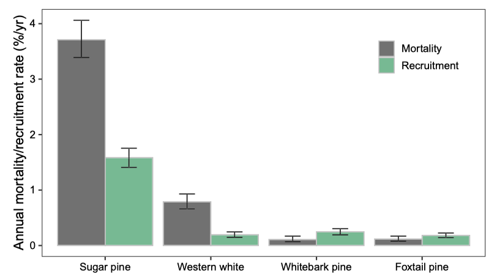

 

## Outreach

 

### California Fire Science Consortium research brief

Released May 2021

https://www.cafiresci.org/research-publications-source/category/whitepinemortality  

Disturbance interactions are a fascinating topic, so I was very excited to read the paper that Joan Dudney and others wrote about the multiple disturbances that white pines face in the southern Sierra Nevada. I wrote a research brief for the California Fire Science Consortium (which has lots of other great briefs too!) so there would be an easy-to-read summary of their study, the findings, and the importance for management. 

Key findings relevant for management:  

- The extent of white pine blister rust increased from 20% of plots in the 1990s to 33% of plots when resampled ~20 years later.  
- The blister rust infection rate declined in sugar pine due to the already very high rate of mortality in sugar pine from earlier infection. Sugar pines also had high amounts of mortality from fire and mountain pine beetle, which all together led to a more rapid decline in sugar pine populations than had previously been documented. Sugar pines may need active restoration in the southern Sierra Nevada to sustain their population.  
- Infection rate of blister rust increased in western white pine and whitebark pine. While no infections were found in plots with foxtail pine, white pine blister rust was observed in foxtail pines outside of the plots for the first time.
- Within each species, lower elevations were associated with increased mortality; these are also the areas most at risk from climate warming impacts.  
- More frequent sampling of long-term monitoring plots is needed to track mortality, especially in the subalpine white pines in the southern Sierra Nevada.  

Figure shows the annual mortality (grey bars) and recruitment rates (green bars) by white pine species. Error bars represent 95% confidence intervals.  

{width=500px}

 

### Google Earth Engine Community Tutorial

Released February 23, 2021

https://developers.google.com/earth-engine/tutorials/community/extract-raster-values-for-points

Almost every ecologist I know has at some point wanted or needed data from a raster file such as elevation, slope, or NDVI, and many people I know work with plot data as well. Extracting those raster values for plots is therefore a pretty essential research task. I knew how to do this in a variety of ways (R, ArcMap, ENVI), but when I realized I needed a time series of reflectance data for my plots across many years, I decided to use Google Earth Engine - it would have been incredibly cumbersome to download all the imagery locally.

After a bit of time puzzling over it on my own and with the help of a friend, I met the Google engineer [Justin Braaten](https://jdbcode.github.io/) at a workshop during the AGU conference. Over the next year (with some starts and stops...) we figured out the best way to get the code working and ways to apply it to a variety of purposes and datasets. I wrote a community tutorial for the code because this is a crucial task, Earth Engine is the perfect platform for it, and there wasn't good documentation about it. If it took a Google engineer a lot of thought and time to figure it out, I wouldn't expect my peers to be able to figure it out quickly. And as a bonus, I learned a lot about Earth Engine as I figured out explanations!  

The tutorial goes through the ideas and code for the basics of extracting raster data for points or polygons, and then three examples. If this is relevant to your work, I encourage you to take a look, try it out, and let me know how it goes! It's all on github, so I am happy to take suggestions for improvement and clarity. 

 

### Coursera class on climate change solutions

Coming Soon! 

After a couple of guest lectures I gave to Dr. Marina Oster's Stanford continuing education classes on climate change solutions and developing climate change action plans, she invited me to contribute to the development of the class for a Coursera format. I have two segments: An intro to fire ecology, including a case study of fire in California, and being zero waste (a practice I've had for a few years).

The section on fire includes the following topics:  

* Fire ecology basics  

* Fire regimes  

* California fire

  + Fire-adapted ecosystems and the history of cultural fire by Indigenous people  

  + Fire suppression  

  + The current issues  

  + Moving forward: prescribed fire, home-hardening, and climate change  

